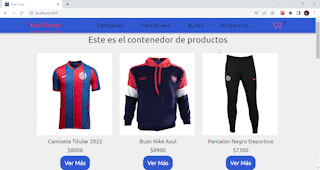

# Tienda Todo Boedo
Conseguí los mejores productos del Club Atlético San Lorenzo de Almagro.

## Objetivo
Proyecto creado para el curso de React JS de CoderHouse.

## Que contiene?

Una página de inicio que muestra todos los productos, una barra de navegación para poder filtrar los productos por categoría y, en cada item, un boton para ver más información del producto seleccionado y mostrar el contador para añadir el producto al carrito.

## Vista Previa

## Librerias utilizadas

- React-Bootstrap
- React-Router-Dom

### Version

1.0

### Autor

Lautaro Gerlero

